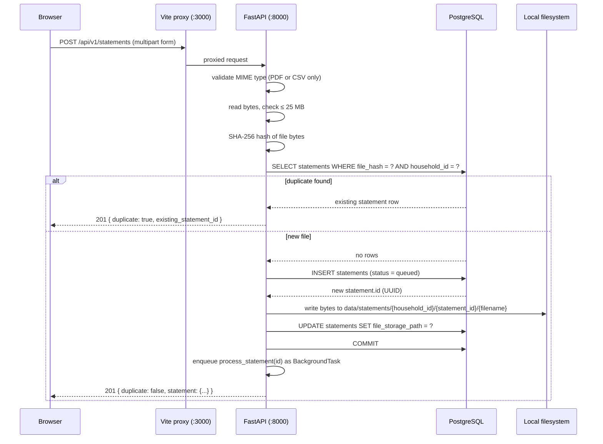
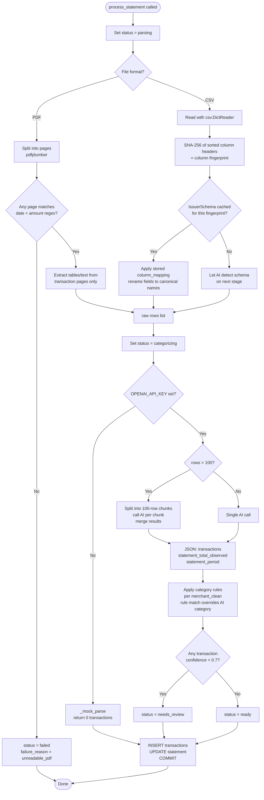
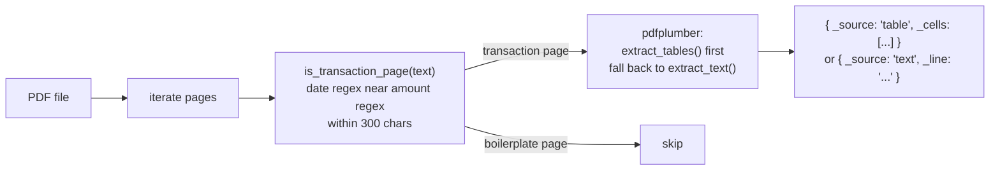
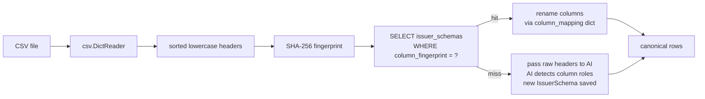
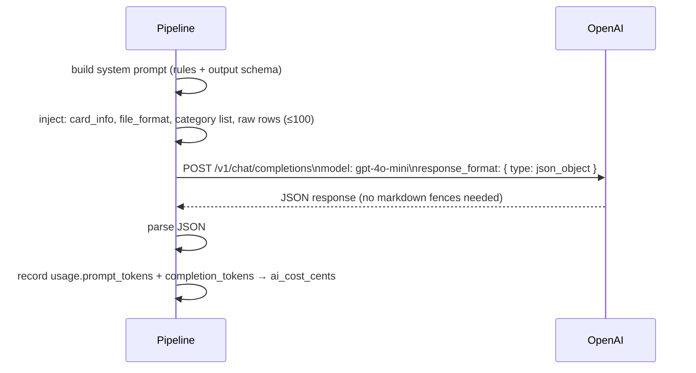
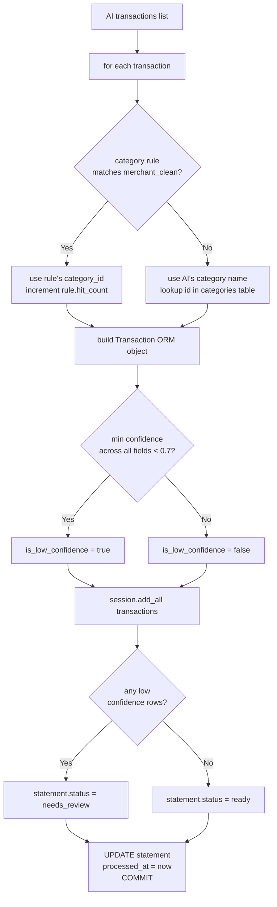
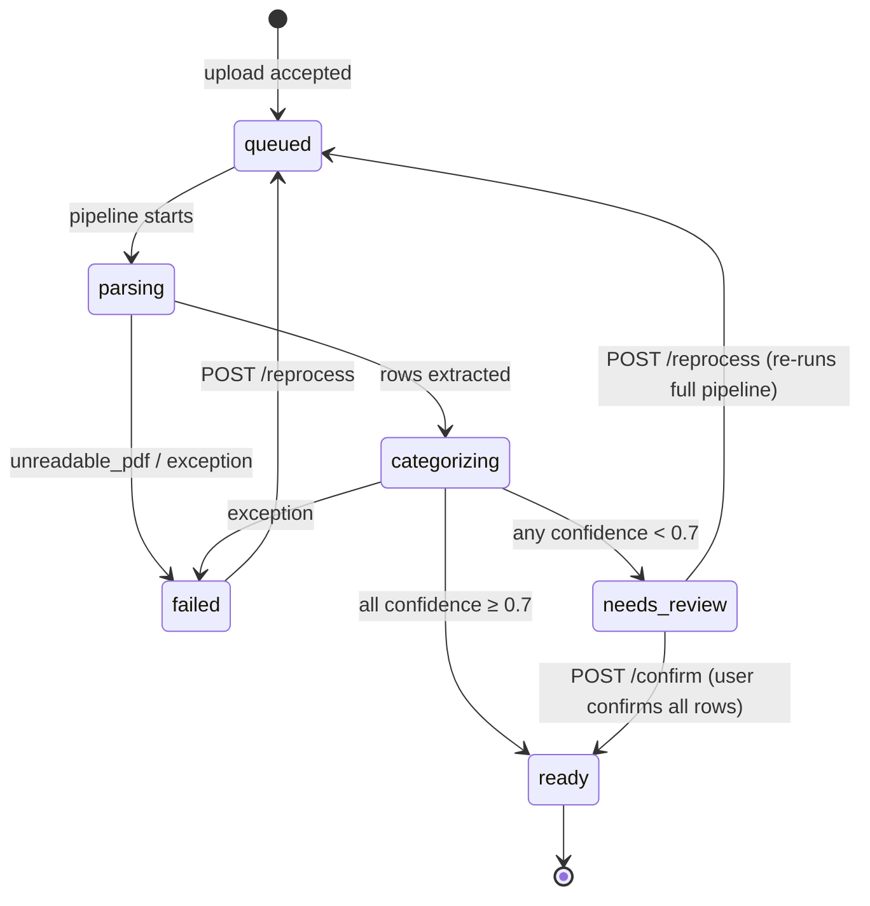
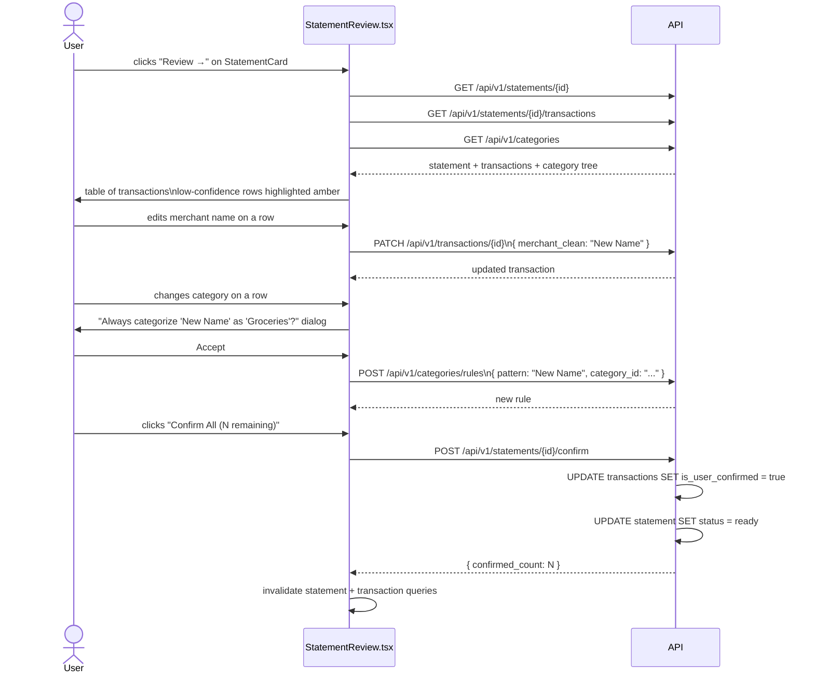
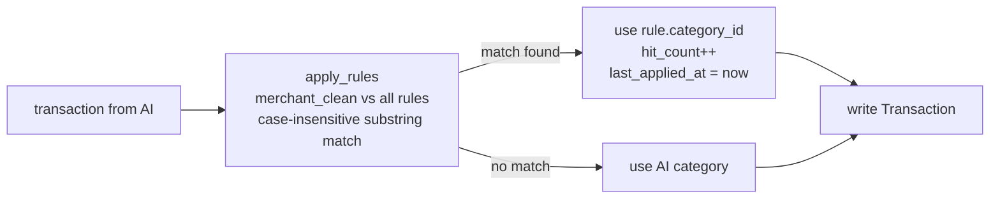
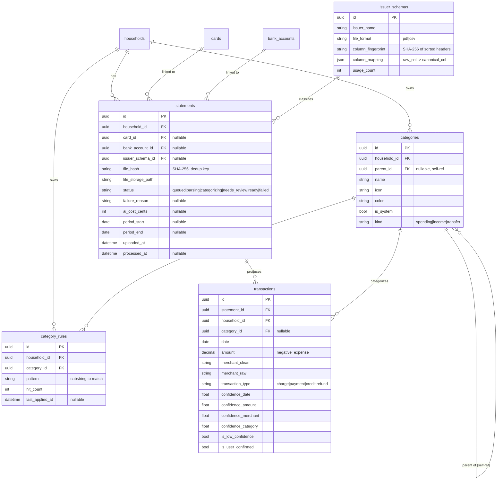

# Statement Upload & Parsing — Technical Reference

This document explains end-to-end how a statement file goes from the user's browser to a list of categorized transactions in the database.

---

## Table of Contents

1. [Upload flow](#1-upload-flow)
2. [Background pipeline stages](#2-background-pipeline-stages)
   - [Stage 0 — Queued](#stage-0--queued)
   - [Stage 1 — Parsing (extract rows)](#stage-1--parsing-extract-rows)
   - [Stage 2 — Categorizing (AI call)](#stage-2--categorizing-ai-call)
   - [Stage 3 — Write & finalize](#stage-3--write--finalize)
3. [Status state machine](#3-status-state-machine)
4. [Review & confirm flow](#4-review--confirm-flow)
5. [Category rules engine](#5-category-rules-engine)
6. [Data model overview](#6-data-model-overview)
7. [Code map](#7-code-map)

---

## 1. Upload flow

The user picks a file and associates it with a card or bank account. The HTTP request is handled synchronously up to the point of saving the file; the heavy parsing work runs in a background task so the HTTP response returns immediately.



**Key files:**
- Upload handler: [`apps/api/src/app/modules/statements/router.py`](../../apps/api/src/app/modules/statements/router.py) — `upload_statement()`
- File save + hash: [`apps/api/src/app/modules/statements/service.py`](../../apps/api/src/app/modules/statements/service.py) — `compute_file_hash()`, `save_file()`
- Frontend uploader: [`apps/web/src/features/statements/StatementUploader.tsx`](../../apps/web/src/features/statements/StatementUploader.tsx)
- Frontend API call: [`apps/web/src/features/statements/statementsApi.ts`](../../apps/web/src/features/statements/statementsApi.ts) — `uploadStatement()`

---

## 2. Background pipeline stages

`process_statement()` is the main orchestrator. It runs in a FastAPI `BackgroundTask` — no separate worker process or queue. Each stage commits to the DB so the frontend's status-polling endpoint always reflects the current stage.



### Stage 0 — Queued

The statement row exists in the DB with `status = queued`. The frontend's `StatementCard` polls `GET /api/v1/statements/{id}/status` every 3 seconds and updates the UI badge in real time.

**Polling:** [`apps/web/src/features/statements/useStatements.ts`](../../apps/web/src/features/statements/useStatements.ts) — `useStatementStatus()` with `refetchInterval: 3000`

---

### Stage 1 — Parsing (extract rows)

Sets `status = parsing`, then extracts a flat list of raw rows from the file. What "a row" looks like differs by format.

#### PDF path



The heuristic that classifies pages:

```python
DATE_PATTERN  = re.compile(r"\b\d{1,2}/\d{1,2}(?:/\d{2,4})?\b")   # MM/DD or MM/DD/YY(YY)
AMOUNT_PATTERN = re.compile(r"\$[\d,]+\.\d{2}|\b-?\d{1,3}(?:,\d{3})*\.\d{2}\b")

def is_transaction_page(text: str) -> bool:
    # a date and an amount must appear within 300 characters of each other
```

Real-world examples this handles:
- **Amex (18 pages):** pages 3–8 are transaction pages; 9–17 are legal boilerplate; 18 is blank
- **Chase checking (4 pages):** page 1 has all 7 transactions; pages 2–4 are disclosures

If zero pages pass the heuristic → `status = failed`, `failure_reason = unreadable_pdf`.

**Code:** [`apps/api/src/app/modules/statements/pipeline.py`](../../apps/api/src/app/modules/statements/pipeline.py) — `is_transaction_page()`, `extract_pdf_pages()`

#### CSV path



**Code:** [`apps/api/src/app/modules/statements/pipeline.py`](../../apps/api/src/app/modules/statements/pipeline.py) — `compute_column_fingerprint()`, `extract_csv_rows()`  
**Model:** [`apps/api/src/app/modules/statements/models.py`](../../apps/api/src/app/modules/statements/models.py) — `IssuerSchema`

---

### Stage 2 — Categorizing (AI call)

Sets `status = categorizing`, then sends the extracted rows to OpenAI. Rows are chunked at 100 per call to stay within context limits; results are merged in order.



**System prompt instructs the model to:**
- Normalize merchant names (`SQ *COFFEE BAR #1234` → `Coffee Bar`)
- Assign a category from the household's category list only
- Use sign convention: negative = expense, positive = credit/payment
- Skip section headers, balance rows, summary rows
- Output ISO 8601 dates
- Return a `confidence_per_field` object (0.0–1.0) for `date`, `amount`, `merchant`, `category`

**Output schema:**
```json
{
  "transactions": [
    {
      "date_iso": "2026-04-14",
      "amount": -45.20,
      "merchant_clean": "Whole Foods",
      "merchant_raw": "WHOLEFDS #10423 AUSTIN TX",
      "transaction_type": "charge",
      "category": "Groceries",
      "confidence_per_field": { "date": 0.99, "amount": 0.99, "merchant": 0.90, "category": 0.85 },
      "notes": null
    }
  ],
  "statement_total_observed": 3337.50,
  "statement_period": { "start": "2026-04-22", "end": "2026-05-22" }
}
```

`response_format: json_object` (JSON mode) guarantees valid JSON — no markdown fence stripping.

**Code:** [`apps/api/src/app/modules/statements/pipeline.py`](../../apps/api/src/app/modules/statements/pipeline.py) — `normalize_with_ai()`, `SYSTEM_PROMPT`, `USER_PROMPT_TEMPLATE`

---

### Stage 3 — Write & finalize



**Cost telemetry** — recorded on every parse:
```
ai_cost_cents = (input_tokens × $0.15 + output_tokens × $0.60) / 1,000,000 × 100
```
Visible via `GET /api/v1/statements/{id}` → `ai_cost_cents` field.

**Code:** [`apps/api/src/app/modules/statements/pipeline.py`](../../apps/api/src/app/modules/statements/pipeline.py) — `process_statement()` (write section)  
**Transaction model:** [`apps/api/src/app/modules/transactions/models.py`](../../apps/api/src/app/modules/transactions/models.py)

---

## 3. Status state machine



**Transitions triggered by:**
| From | To | Trigger |
|------|----|---------|
| upload | `queued` | `upload_statement()` |
| `queued` | `parsing` | `process_statement()` start |
| `parsing` | `categorizing` | rows extracted successfully |
| `parsing` | `failed` | `unreadable_pdf` or unhandled exception |
| `categorizing` | `ready` | all transaction confidence ≥ threshold |
| `categorizing` | `needs_review` | any transaction confidence < threshold |
| `failed` / `needs_review` | `queued` | `POST /api/v1/statements/{id}/reprocess` |
| `needs_review` | `ready` | `POST /api/v1/statements/{id}/confirm` |

**Router:** [`apps/api/src/app/modules/statements/router.py`](../../apps/api/src/app/modules/statements/router.py)  
**Transactions router:** [`apps/api/src/app/modules/transactions/router.py`](../../apps/api/src/app/modules/transactions/router.py)

---

## 4. Review & confirm flow

When a statement lands in `needs_review`, the user must inspect and approve the extracted transactions.



**Frontend components:**
- Detail page: [`apps/web/src/routes/secure/statements.$statementId.tsx`](../../apps/web/src/routes/secure/statements.$statementId.tsx)
- Review table: [`apps/web/src/features/statements/StatementReview.tsx`](../../apps/web/src/features/statements/StatementReview.tsx)
- Editable row: [`apps/web/src/features/transactions/TransactionRow.tsx`](../../apps/web/src/features/transactions/TransactionRow.tsx)
- Category picker: [`apps/web/src/features/transactions/CategoryPicker.tsx`](../../apps/web/src/features/transactions/CategoryPicker.tsx)

**API hooks:**
- [`apps/web/src/features/transactions/useTransactions.ts`](../../apps/web/src/features/transactions/useTransactions.ts) — `useTransactions`, `useUpdateTransaction`, `useConfirmStatement`
- [`apps/web/src/features/categories/useCategories.ts`](../../apps/web/src/features/categories/useCategories.ts) — `useCategories`, `useCreateRule`

---

## 5. Category rules engine

Rules let users teach the system: "whenever you see this merchant, always use this category." They are applied **before** the AI category is written to the DB, so the rule always wins.



Rule creation happens in two ways:
1. **Review dialog** — user changes a category, UI prompts "Always categorize X as Y?", user clicks Accept → `POST /api/v1/categories/rules`
2. **Settings** (future) — user manages rules directly

**Rule matching** is a simple in-memory loop — no DB query per transaction:
```python
def apply_rules(rules: list[CategoryRule], merchant_clean: str) -> CategoryRule | None:
    merchant_lower = merchant_clean.lower()
    for rule in rules:
        if rule.pattern.lower() in merchant_lower:
            return rule
    return None
```

First match wins. Multiple matching rules → the first rule in insertion order wins (most recently created is at the end, so oldest rule wins — this is intentional for predictability).

**Code:** [`apps/api/src/app/modules/categories/service.py`](../../apps/api/src/app/modules/categories/service.py) — `apply_rules()`  
**Model:** [`apps/api/src/app/modules/categories/models.py`](../../apps/api/src/app/modules/categories/models.py) — `CategoryRule`

---

## 6. Data model overview



---

## 7. Code map

| Concern | File |
|---------|------|
| Upload HTTP handler | [`apps/api/src/app/modules/statements/router.py`](../../apps/api/src/app/modules/statements/router.py) |
| File save, hash, duplicate check | [`apps/api/src/app/modules/statements/service.py`](../../apps/api/src/app/modules/statements/service.py) |
| Full pipeline orchestrator | [`apps/api/src/app/modules/statements/pipeline.py`](../../apps/api/src/app/modules/statements/pipeline.py) |
| PDF page classifier | `pipeline.py` → `is_transaction_page()` |
| PDF row extractor | `pipeline.py` → `extract_pdf_pages()` |
| CSV row extractor + fingerprint | `pipeline.py` → `extract_csv_rows()`, `compute_column_fingerprint()` |
| AI call (OpenAI) | `pipeline.py` → `normalize_with_ai()` |
| Transaction write + status update | `pipeline.py` → `process_statement()` (write section) |
| Statement ORM model | [`apps/api/src/app/modules/statements/models.py`](../../apps/api/src/app/modules/statements/models.py) |
| Transaction ORM model | [`apps/api/src/app/modules/transactions/models.py`](../../apps/api/src/app/modules/transactions/models.py) |
| Category + CategoryRule models | [`apps/api/src/app/modules/categories/models.py`](../../apps/api/src/app/modules/categories/models.py) |
| Category seeding (52 defaults) | [`apps/api/src/app/modules/categories/service.py`](../../apps/api/src/app/modules/categories/service.py) → `seed_categories()` |
| Rule matching | `categories/service.py` → `apply_rules()` |
| Confirm statement endpoint | [`apps/api/src/app/modules/transactions/router.py`](../../apps/api/src/app/modules/transactions/router.py) |
| Status polling hook | [`apps/web/src/features/statements/useStatements.ts`](../../apps/web/src/features/statements/useStatements.ts) → `useStatementStatus()` |
| Statement detail page | [`apps/web/src/routes/secure/statements.$statementId.tsx`](../../apps/web/src/routes/secure/statements.$statementId.tsx) |
| Review table + confirm button | [`apps/web/src/features/statements/StatementReview.tsx`](../../apps/web/src/features/statements/StatementReview.tsx) |
| Editable transaction row | [`apps/web/src/features/transactions/TransactionRow.tsx`](../../apps/web/src/features/transactions/TransactionRow.tsx) |
| Category picker | [`apps/web/src/features/transactions/CategoryPicker.tsx`](../../apps/web/src/features/transactions/CategoryPicker.tsx) |
| DB migration | [`apps/api/alembic/versions/76d03a4c761b_add_categories_rules_transactions.py`](../../apps/api/alembic/versions/76d03a4c761b_add_categories_rules_transactions.py) |
